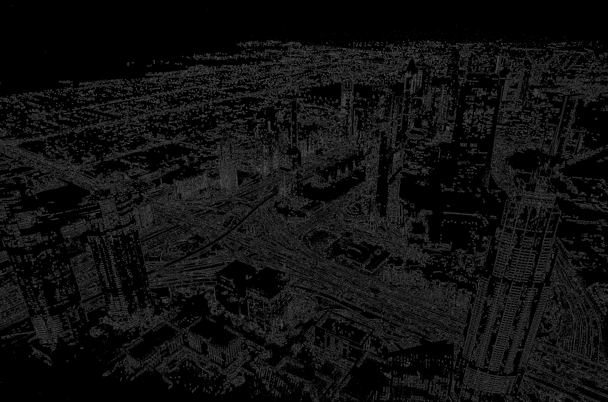
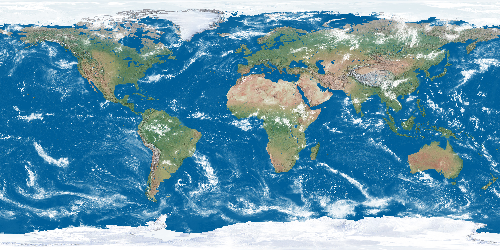
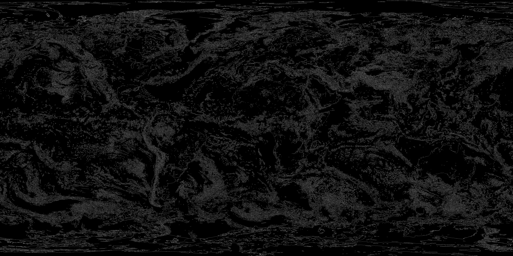

# CannyCore - Metoda Canny de detectie a muchiilor

Acest proiect exploreaza implementarea si optimizarea algoritmului Canny pentru detectia de contururi, pornind de la o versiune seriala si ajungand la diverse implementari paralele.

**[➡️ Documentația tehnică, analiza performanței (profilare) și jurnalul de progres](docs/README.md)**
---

### Echipa

*   **Membru 1:** Boncan Dragoș-Eduard-Gabriel, Grupa 345C1
*   **Membru 2:** Timofte Andrei-Ioan, Grupa 343C1
*   **Membru 3:** Ion Daniel, Grupa 343C1

### Asistent de laborator

*   Calafeteanu Tudor-Alexandru

---

## Descrierea Proiectului

Algoritmul Canny este o metoda ce foloseste mai multe etape de procesare, utilizata pentru a detecta o gama larga de contururi in imagini. Datorita complexitatii sale computationale, este un candidat excelent pentru paralelizare.

### Etapele Algoritmului

1.  **Conversia la Grayscale**
    *   Transforma imaginea din RGB intr-o imagine cu un singur canal de intensitate pentru a simplifica procesarea.
    *   Formula de luminozitate folosita este: `Y = 0.299*R + 0.587*G + 0.114*B`.

2.  **Aplicarea Filtrului Gaussian**
    *   Reduce zgomotul din imagine, un pas esential pentru a preveni detectia falsa de contururi.
    *   Parametrii `kernel_size` si `sigma` sunt configurabili.

3.  **Calculul Gradientului (Sobel)**
    *   Se aplica doua masti de convolutie (Sobel Gx si Gy) pentru a detecta intensitatea si directia contururilor.
    *   **Magnitudinea:** $mag = \sqrt{G_x^2 + G_y^2}$ (cat de puternica este muchia)
    *   **Directia:** $\theta = \arctan2(G_y, G_x)$ (orientarea muchiei)

4.  **Non-Maximum Suppression (NMS)**
    *   Subtiaza muchiile la o grosime de un singur pixel.
    *   Pastreaza doar pixelii care reprezinta un maxim local in directia gradientului.

5.  **Prag Dublu (Double Threshold)**
    *   Clasifica pixelii ramasi in trei categorii, folosind doua praguri (`low` si `high`):
        *   **Strong edges:** Pixeli cu magnitudinea peste `high`.
        *   **Weak edges:** Pixeli cu magnitudinea intre `low` si `high`.
        *   **Non-edges:** Pixeli cu magnitudinea sub `low`.

6.  **Hysteresis Edge Tracking**
    *   Finalizeaza detectia contururilor.
    *   Pastreaza pixelii `weak` doar daca sunt conectati la un pixel `strong`, folosind o parcurgere (ex: DFS recursiv).
    *   Pixelii `weak` izolati sunt eliminati.

Obiectivele acestui proiect sunt:
1.  Implementarea unei versiuni seriale corecte a algoritmului.
2.  Profilarea versiunii seriale pentru a identifica sectiunile critice.
3.  Implementarea unor versiuni paralele (OpenMP, Pthreads, MPI, CUDA).
4.  Analiza comparativa a performantei fiecarei implementari.

---

## Exemplu de Rulare

Mai jos este un exemplu pentru compilarea si rularea implementarii **OpenMP**.

```bash
# 1. Din root-ul repository-ului, compileaza toate implementarile folosind Makefile-ul
make

# 2. Ruleaza implementarea OpenMP cu imagine dorita
# Argumente: <input> [output] [low_thresh] [high_thresh] [kernel] [sigma] [threads]
make run_openmp INPUT=./images/input/city.jpg OUTPUT=./images/output/city_openmp.jpg LOW=15 HIGH=40 KERNEL_SIZE=9 SIGMA=1.5 THREADS=8
```

## Exemplu Input/Output

| Imagine Originala | Imagine Procesata (Canny) |
| :---: | :---: |
|  |  |
|  |  |
