## Analiză Comparativă Globală: Canny Edge Detection

## De la Serial la Multi-GPU și Cluster Computing

Această analiză integrează rezultatele obținute din **9 implementări diferite** ale algoritmului Canny Edge Detection, testate pe arhitecturi variate (CPU Haswell, Noduri XL, NVIDIA GPU). Scopul este de a evidenția trade-off-urile dintre complexitatea implementării și performanța brută, identificând soluția optimă în funcție de scenariul de utilizare.

## 1. Ierarhia Performanței

Analizând **Timpul Total de Execuție** pentru imaginea de referință `1_earth_8k.jpg` (8192x4096), putem clasifica implementările în trei niveluri distincte de performanță.

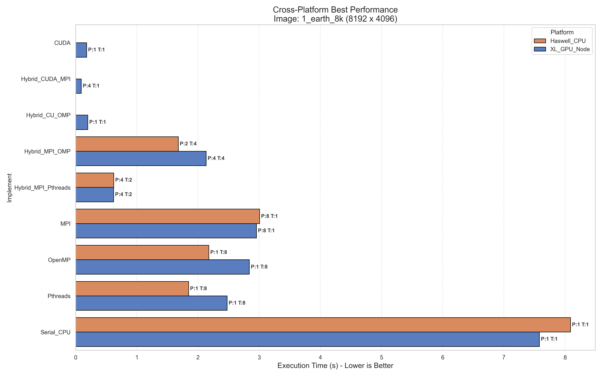

Graficul de mai sus evidențiază diferența uriașă dintre CPU și GPU. În timp ce barele pentru CPU (Serial, Pthreads, MPI) se măsoară în secunde (în cel mai rău caz, rularea pipeline-ului durează peste +8s), implementările CUDA sunt abia vizibile, fiind sub 0.5 secunde. Acest lucru confirmă că pentru operații matriciale masive (convoluții), precum cele ce se realizează în cadrul Canny Edge Detection (ex. aplicarea blur-ului Gaussian, aplicarea kernel-ului Sobel), GPU-ul este superior cu ordine de mărime.

### Tier 1: Accelerare Hardware (GPU)

* **Cei mai eficienți algoritmi:** `CUDA`, `Hybrid CUDA+OpenMP`, `Hybrid CUDA+MPI`
* **Timp:** \~0.4s - 0.6s
* **Observație:** Implementările bazate pe GPU sunt de departe cele mai performante, oferind un speedup de **\~15x - 18x** față de varianta serială. Aici, limita nu mai este puterea de calcul, ci latența kernel-urilor și transferul de date Host-to-Device.
* **Notă**: Timpul înregistrat pentru `Hybrid CUDA+MPI` este doar timpul de calcul, excluzând alocarea. În realitate, acest algoritm are cele mai slabe rezultate dintre modelele CUDA implementate.

### Tier 2: Paralelism Eficient pe CPU

* **Alternative:** `Hybrid MPI+Pthreads`, `Pthreads`, `OpenMP`
* **Timp:** \~0.6s - 2.5s (în funcție de nr. de threads)
* **Observație:** Variantele bine optimizate pe CPU (în special Pthreads și Hybrid MPI+Pthreads) oferă cei mai buni timpi. Ele reprezintă soluția ideală dacă nu dispunem de GPU-uri.

### Tier 3: Baseline și Overhead

* **Cei mai ineficienți algoritmi:** `Serial`, `MPI`
* **Timp:** > 2.7s - 8s
* **Observație:** Varianta serială este limitată de frecvența procesorului. Varianta MPI suferă masiv din cauza overhead-ului de comunicare (`MPI_Scatter/Gather`) atunci când este rulată pe un singur nod, datele fiind duplicate inutil în memorie.

## 2. OpenMP vs. Pthreads vs. MPI

Pentru a înțelege nuanțele performanței pe CPU, analiza Heatmap-ului global este esențială:

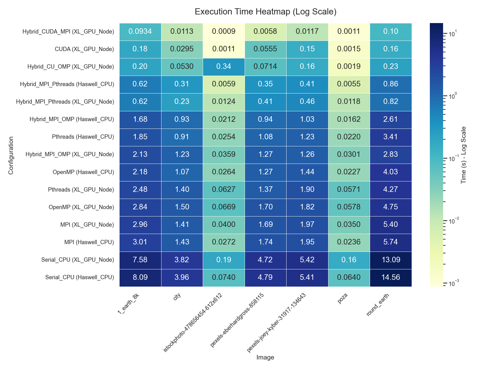

Zonele "reci" (albastru închis) indică timpii cei mai mari. Se observă că implementările Hibride (MPI+Pthreads, MPI+OpenMP) reușesc să mențină performanța chiar și la imagini mai mari, în timp ce MPI pur rămâne o zonă "rece" (timpi mari) din cauza overhead-ului de comunicare inter-procese.

De asemenea, se poate observa că zona corespunzătoare implementărilor CUDA este caracterizată de cele mai „calde” culori, ceea ce indică faptul că aceste versiuni de edge detection obțin cei mai mici timpi de execuție.

### OpenMP vs. Pthreads

Deși ambele vizează memoria partajată, comparând curbele de scalabilitate observăm diferențele dintre cele 2 implementări:

| Pthreads Scalability | OpenMP Scalability |
| :---: | :---: |
| 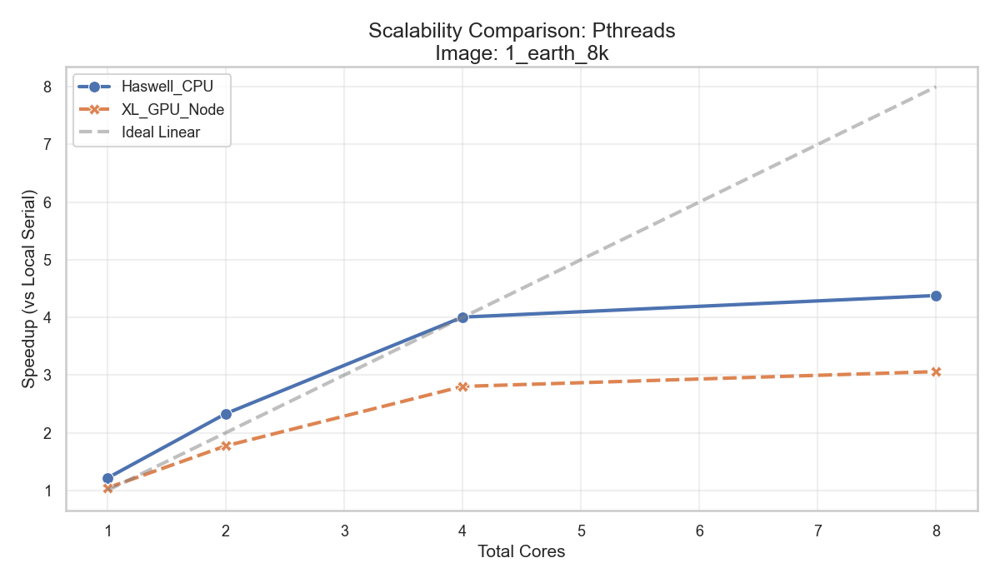 | 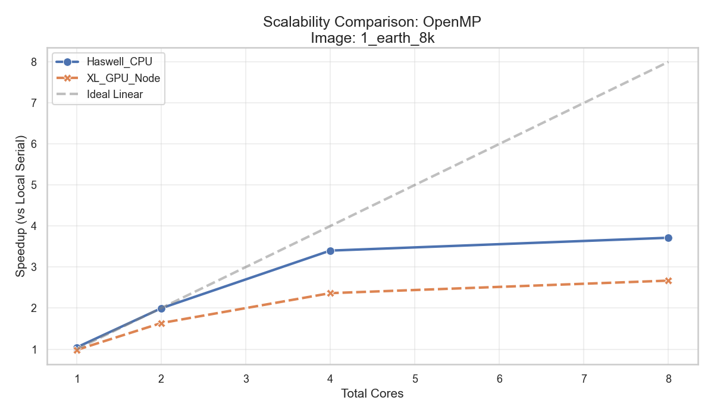 |

* **Pthreads:** Prezintă o scalare mai stabilă și mai apropiată de cea ideală, datorită controlului explicit asupra thread-urilor și distribuirii statice a datelor, ceea ce reduce overhead-ul de execuție.
* **OpenMP:** Deși ușor de implementat (`#pragma`), introduce un overhead suplimentar de runtime, iar acest lucru se reflectă printr-o abatere mai mare față de scalarea ideală la un număr mai mare de thread-uri.

### Performanțele slabe ale MPI-ului

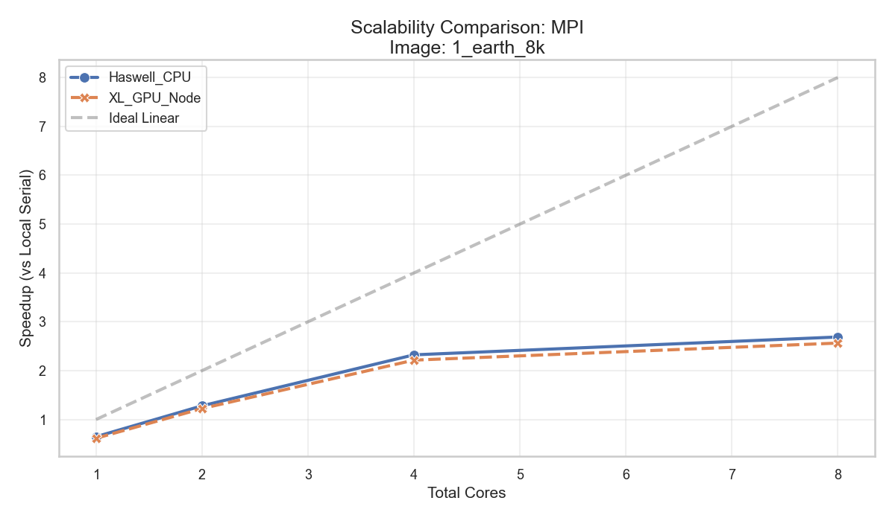

* **Analiză Eșec:** Graficul de mai sus arată o scalare limitată pentru MPI pe un singur nod.
* **Cauza:** MPI este gândit pentru memorie distribuită, iar rularea mai multor procese MPI pe același nod introduce overhead de comunicare inter-proces. Chiar dacă datele se află fizic pe aceeași mașină, procesele au spații de memorie separate, ceea ce implică operații suplimentare de copiere și sincronizare, reducând eficiența comparativ cu modelele de memorie partajată.

### Soluția Câștigătoare pe CPU: Hybrid MPI + Pthreads

Această implementare a reușit să combine avantajele ambelor tehnologii. Folosind MPI doar pentru comunicarea între noduri fizice și Pthreads pentru utilizarea nucleelor locale, am eliminat bottleneck-ul de rețea.

Graficul de mai sus demonstrează o scalare aproape liniară (linia albastră "Actual Speedup" urmărește îndeaproape linia gri punctată "Ideal Speedup" până la 8-16 nuclee).

Superioritatea acestei metode se datorează următoarelor motive:
* **Reducerea Comunicării**: Spre deosebire de MPI unde 16 procese ar trimite mesaje prin rețea, aici avem doar câteva procese MPI care comunică.
* **Memorie Partajată**: În interiorul nodului, Pthreads accesează shared memory, eliminând complet copierea redundantă a datelor ce provoca probleme în varianta MPI.

Rezultat: Aceasta este singura configurație CPU care evită plafonarea timpurie, combinând atât elemente de shared memory, cât și elemente de distributed memory.

### O altă perspectivă asupra algoritmilor hibrizi

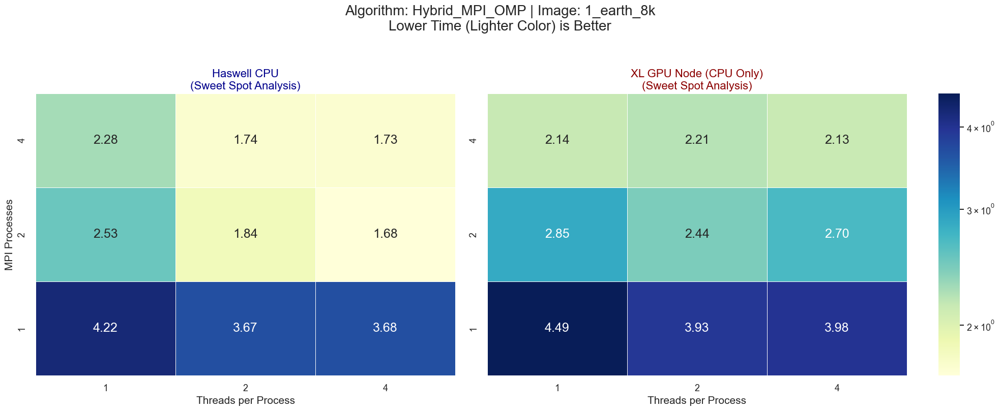

Această analiză de tip "Sweet Spot" ilustrează eficiența algoritmului hibrid MPI + OpenMP, unde culorile deschise indică timpii optimi de execuție pe arhitecturile Haswell și XL. Configurația ideală pe Haswell este atinsă la 2 Procese MPI x 4 Thread-uri cu un timp de 1.68s, demonstrând un speedup de 2.5x față de varianta baseline (4.22s). Se observă cum hibridizarea echilibrează perfect puterea de calcul cu overhead-ul de comunicare, obținând performanțe superioare față de utilizarea exclusivă a proceselor MPI (axa Y) sau a thread-urilor (axa X). Deși nodul XL scalează liniar atingând 2.13s, arhitectura Haswell oferă timpi absoluți mai buni, subliniind importanța adaptării strategiei de paralelizare la specificul hardware. Graficul confirmă vizual că pentru această dimensiune a problemei, o distribuție mixtă a resurselor (Distributed + Shared Memory) este soluția optimă.

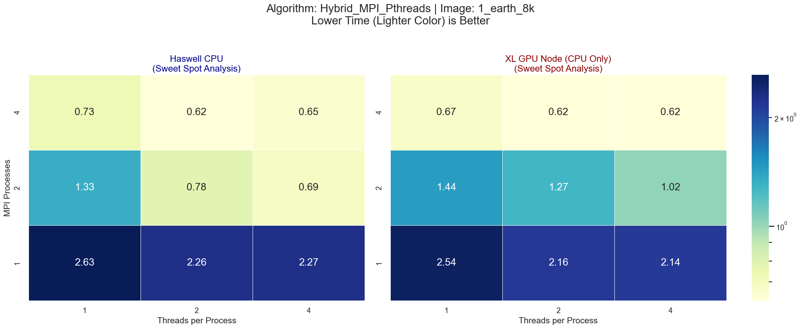

Aceasta este o analiză a scalabilității optimizate, evidențiind un salt major de performanță cu un timp minim de execuție de 0.62s atins la configurația 4 Procese MPI x 2 Thread-uri pe ambele arhitecturi. Comparativ cu baseline-ul de ~2.63s, se obține un speedup impresionant de 4.2x, graficul arătând o preferință clară pentru un număr mai mare de procese MPI (linia de sus fiind uniform performantă). Culorile deschise predominante în jumătatea superioară indică faptul că overhead-ul de comunicare a fost minimizat, iar algoritmul scalează eficient chiar și pe nodul XL, unde timpii sunt identici cu cei de pe Haswell. Configurația de 4 MPI x 2 Thread-uri reprezintă punctul ideal de eficiență ("Sweet Spot"), oferind cel mai bun echilibru între paralelizarea distribuită și cea partajată pentru această implementare.

  
<strong>1. Click pentru rezultate: Imaginea City</strong>

   

  **Hybrid MPI + OpenMP**
  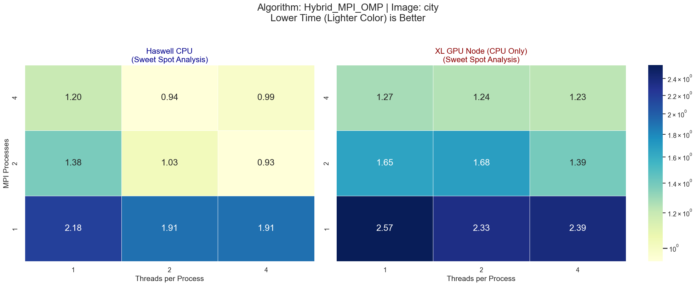
  
  **Hybrid MPI + Pthreads**
  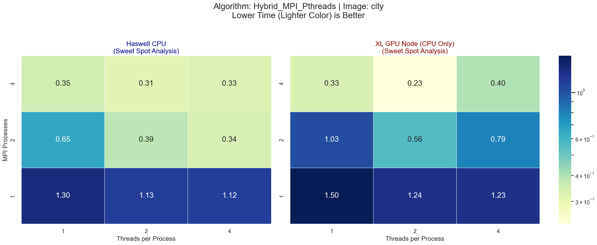

 

  
<strong>2. Click pentru rezultate: Imaginea Round Earth</strong>

   

  **Hybrid MPI + OpenMP**
  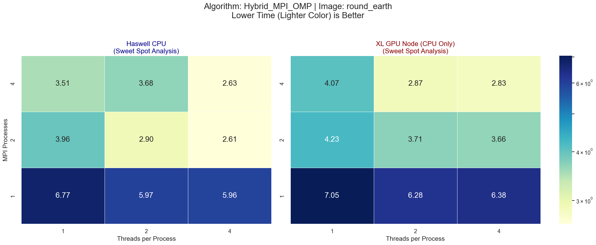

  **Hybrid MPI + Pthreads**
  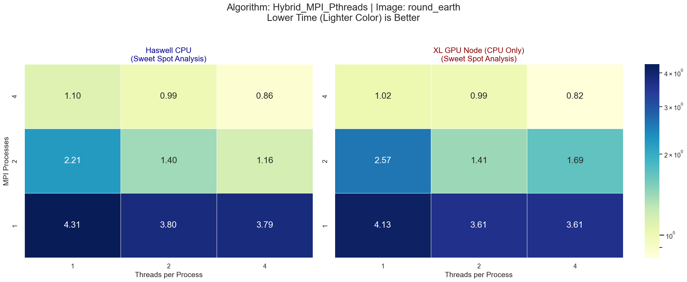

 

  
<strong>3. Click pentru rezultate: Imaginea Poza</strong>

   

  **Hybrid MPI + OpenMP**
  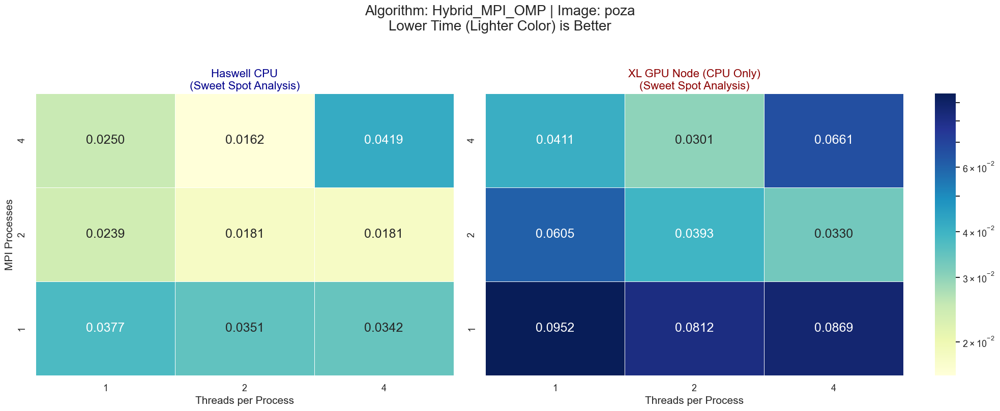

  **Hybrid MPI + Pthreads**
  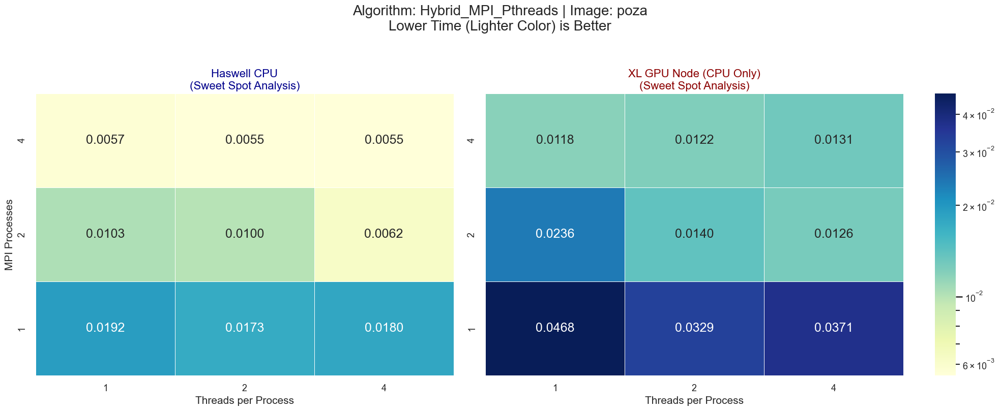

 

  
<strong>4. Click pentru rezultate: iStock Photo</strong>

   

  **Hybrid MPI + OpenMP**
  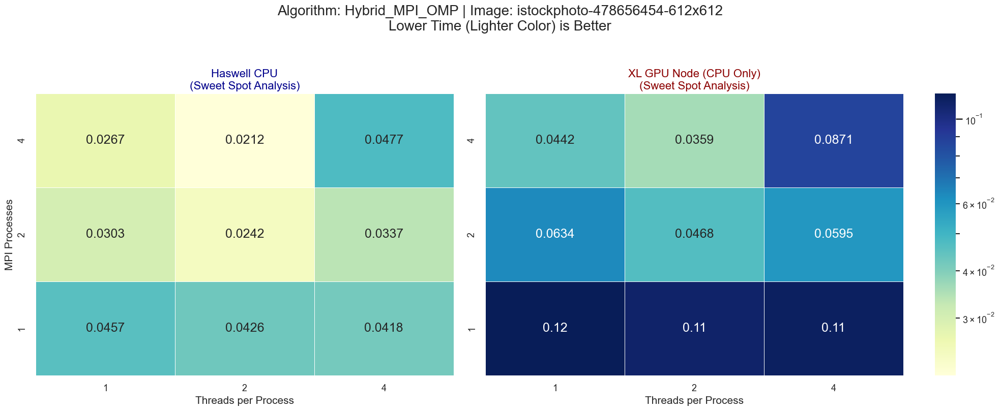

  **Hybrid MPI + Pthreads**
  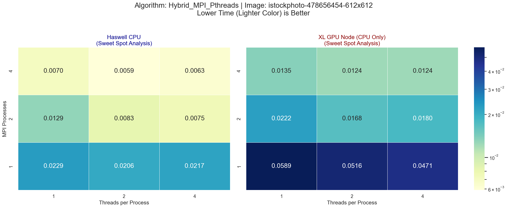

 

  
<strong>5. Click pentru rezultate: Pexels Eberhard Gross</strong>

   

  **Hybrid MPI + OpenMP**
  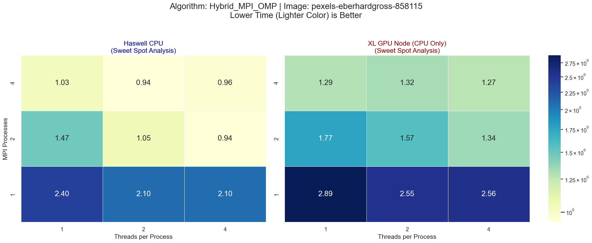

  **Hybrid MPI + Pthreads**
  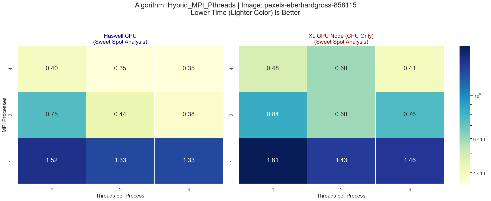

 

  
<strong>6. Click pentru rezultate: Pexels Joey Kyber</strong>

   

  **Hybrid MPI + OpenMP**
  

  **Hybrid MPI + Pthreads**
  

## 3. O nouă tehnologie - GPU

Trecerea la CUDA a schimbat fundamental profilul de execuție al algoritmului. Puterea brută de calcul modifică complet locurile unde se pierde timp.

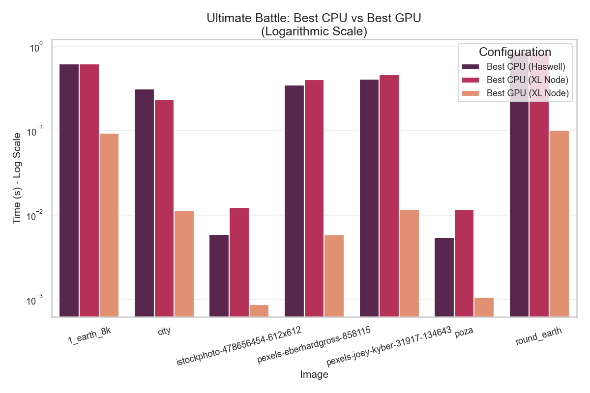

### Schimbarea de paradigmă

Pentru a înțelege de ce GPU-ul este de 15x mai rapid, trebuie să ne uităm la **Breakdown-ul pe etape**:

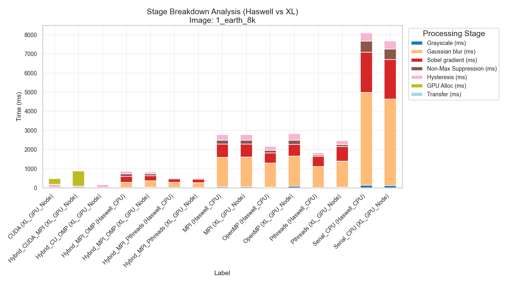

**Analiză Breakdown:**
* **Pe CPU (stânga):** Timpul este dominat de **Gaussian Blur** (portocaliu) și **Sobel** (verde). Acestea sunt calcule matematice grele, perfect paralelizabile.
* **Pe GPU (dreapta):** Barele pentru Blur și Sobel aproape au dispărut (sunt extrem de subțiri). În schimb, timpul este acum dominat de **Hysteresis** (mov) și **Transfer/Alocare** (albastru).

**Concluzie:** Am atins limita legii lui Amdahl. Hysteresis Edge Tracking este un algoritm recursiv (DFS/BFS) care este inerent serial. Nu putem prezice următorul pixel de muchie fără a-l cunoaște pe cel curent. Astfel, pe GPU, deși am accelerat masiv matematica, am rămas blocați de această etapă secvențială.

## 4. Analiză Scalabilitate

Analizând toate graficele de scalabilitate de mai sus, observăm un pattern comun la 8-16 fire de execuție: **Plafonarea**.

* Indiferent dacă folosim OpenMP, Pthreads sau hibrizi, speedup-ul nu mai crește liniar după 4-8 nuclee.
* **Explicația:** Algoritmul Canny este *Memory Bound*. Operațiile de convoluție (Blur, Sobel) necesită citirea și scrierea intensivă a pixelilor (un pixel e citit de 9 ori pentru un kernel 3x3). Procesorul modern (în special pe nodurile XL) calculează mult mai repede decât poate memoria RAM să îi livreze datele. Astfel, adăugarea de nuclee suplimentare doar aglomerează magistrala de memorie, fără a aduce câștiguri de performanță.

## 5. Concluzii Finale și Recomandări

Pe baza rulărilor algoritmilor pe setul de test, am întocmit următorul clasament:

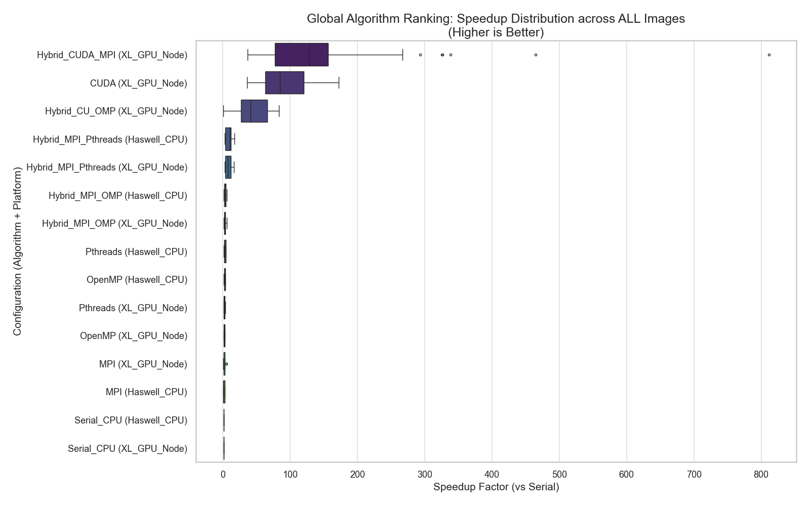

**Interpretare Boxplot:**
* **Varianță:** Variantele CUDA au box-urile mai proeminente, indicând timpi de execuție variabili.
* **Consistență:** Implementările CPU (Serial, MPI) au box-urile mult mai subțiri, indicând timpi de execuție consistenți și predictibili.

### Tabel Recomandări

| Scenariu de Utilizare | Implementare Recomandată | Motivare | 
 | ----- | ----- | ----- | 
| **Performanță Maximă (Single Image)** | **CUDA (Block Size 16x16)** | Cel mai mic timp de execuție (0.45s pentru 8K). GPU-ul este imbatabil la convoluții. | 
| **Procesare Batch (Multe imagini)** | **Hybrid CUDA + OpenMP** | Permite procesarea a 4 imagini simultan pe un singur GPU, maximizând throughput-ul (imagini/secundă). | 
| **Imagini Gigantice ( > Memorie GPU)** | **Hybrid CUDA + MPI** | Permite spargerea imaginii în fâșii și procesarea pe mai multe GPU-uri din cluster. | 
| **Cluster CPU (Fără GPU)** | **Hybrid MPI + Pthreads** | Cea mai robustă scalare pe CPU. Evită overhead-ul excesiv al MPI-ului. | 
| **Simplitate** | **OpenMP** | Oferă un speedup decent (3-4x) cu modificări minime ale codului serial. |