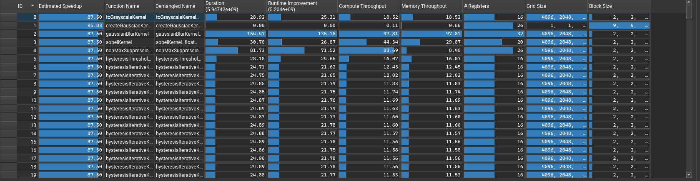
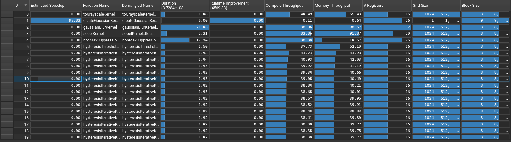
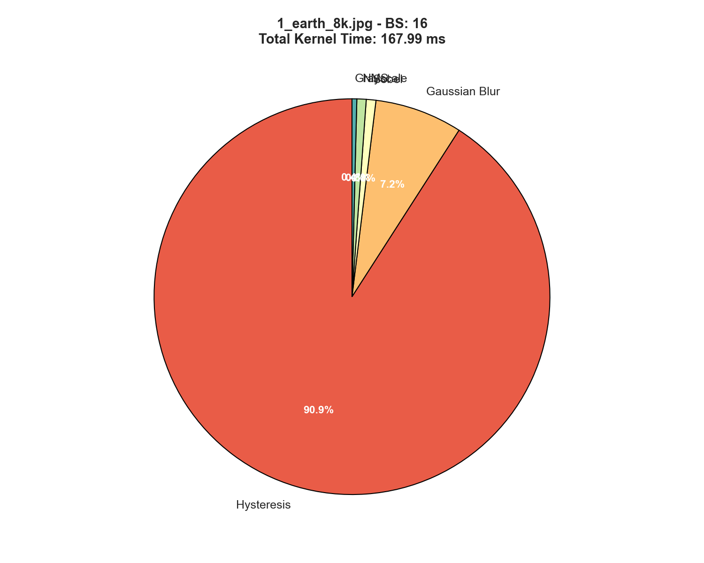
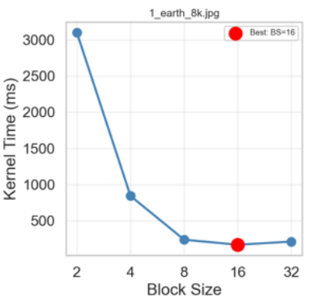
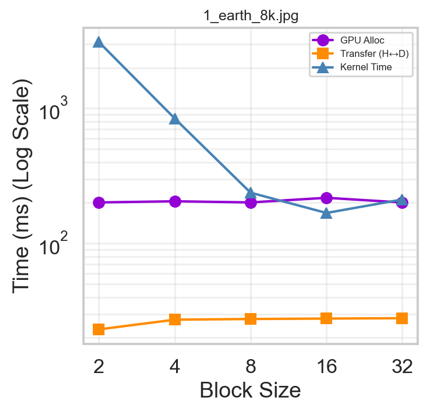
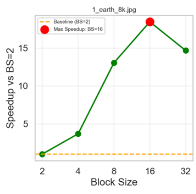
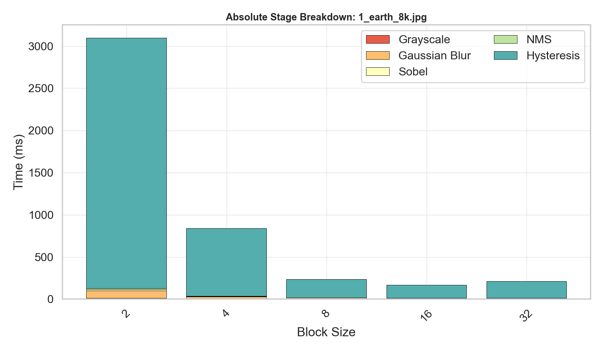

## Implementare CUDA - Inovații & Diferențe
În implementarea algoritmului **Canny Edge Detection** folosind **CUDA**, am adaptat versiunea serială a algoritmului printr-o serie de optimizări specifice execuției pe GPU. Aceste modificări au dus la rezultate foarte bune în testele realizate pe setul de imagini, utilizând mai multe configurații pentru dimensiunea block-urilor.

Modificările realizate sunt următoarele:
* **paralelizarea pe GPU** - versiunea serială procesează pixelii secvențial, calculând gradienți, magnitudini etc. În versiunea CUDA, fiecare thread procesează un pixel, permițând procesarea simultană a întregii imagini și reducând drastic timpul de execuție;
* **funcțiile devenite kernel** - funcții ce erau aplicate pe întreaga imagine cum ar fi _toGrayscale_ sau _gaussianBlur_ au fost rescrise ca CUDA kernels pentru procesarea paralelă a pixelor pe mii de thread-uri;
* **utilizare shared memory** - pentru _createGaussianKernel_, am utilizat un singur block de NxN thread-uri (N = size-ul matricii kernelului Gaussian), cu shared memory, reducând accesul la global memory și optimizând astfel performanța;
* **eliminarea recursivității** - funcția hysteresisThreshold din versiunea serială folosea recursivitate, incompatibilă cu execuția pe GPU. Implementarea CUDA folosește un proces iterativ repetat până la convergență (până când niciun pixel slab nu mai este promovat);
* **configurabilitatea dimensiunii blockului** - dimensiunea block-ului CUDA poate fi setată din argumentele programului, permițând testarea mai multor configurații;
* **pipeline pe device** - în versiunea serială totul rulează pe CPU, în cazul curent, toate datele sunt rulate pe device pentru a minimiza transferurile costisitoare.


Flow-ul final al execuției este următorul:
```
CPU: Încarcă imagine → Transfer pe GPU
GPU: Grayscale → Blur → Sobel → NMS → Hysteresis
GPU → CPU: Transfer rezultat final
```
## Provocări întâmpinate
1. **Hysteresis pe GPU** - trecerea de la recursivitate la un algoritm iterativ de promovare a muchiilor slabe a necesitat o regândire completă a procesului;
2. **Memory management** - alocarea și eliberarea resurselor între host și device au necesitat o "dublă" atenție;
3. **Limitările shared memory** - în cazul nostru, dimensiunea kernelului Gaussian este destul de redusă. Pentru kernel-uri mai mari, ar fi necesară o abordare diferită.

## Profiling & Rezultate obținute

Pentru partea de profiling, am folosit _Nsight Compute_ pe un sistem cu **NVIDIA RTX 2000 ADA Generation**.

{width=1148 height=320}

Imaginea de mai sus surprinde rezultatul obținut în urma rulării variantei CUDA a algoritmului Canny pe image _1_earth_8k.png_ (8192x4096 pixels, 3 channels). \
Pentru a stabili o referință, am testat inițial kernel-urile cu o dimensiune a blockului de 2x2 (4 threaduri), simulând un scenariu de ocupare minimă a resurselor. Profiler-ul a raportat un _Estimated Speedup_ de 87.5%, o valoare care indică direct ineficiența utilizării hardware-ului. Dat fiind faptul că warp-urile de pe GPU au 32 de thread-uri, utilizarea a doar 4 fire per bloc înseamnă că 28 de fire (87.5%) sunt inactive în fiecare ciclu de execuție. \
Mai mult, _Grid size-ul_ excesiv de mare (4096 x 2048 blocks) și valorile mici ale _Compute Throughput_ și _Memory Thorughput_ indică faptul că utilizarea, folosind acest kernel size, este suboptimă. Putem concluziona că, în cazul de față, algoritmii sunt **Latency Bound**, adică configurația proastă nu permit utilizarea la maxim a puterii de calcul sau a lățimii benzii.

Următoarea imagine surprinde trecerea de la această varianta, suboptimă, la o variantă mult mai îmbunătățită, ce folosește 8x8 thread-uri per block.
{width=1174 height=329}

Trecerea la această configurație de 64 de thread-uri a eliminat complet ineficiența de planificare a wrap-urilor, _Estimated Speedup_ scăzând la 0%. \
Kernel-urile _gaussianBlurKernel_ și _sobelKernel_ demonstrează, de asemenea, o eficiența de dorit, atingând aproape 100% _Memory Throughput_, aproape de limita fizică maximă a plăcii. Din acest fapt putem deduce că algoritmii sunt **Memory Bound**, fiind limitați de lățimea benzii. \
Pentru alte kernel-uri, cum ar fi kernel-ul iterativ _hysteresis_, se observă un throughput mai redus, atât la Compute, cât și la Memory (aprox. 40%), dar totuși este o îmbunătățire față de scenariul 2x2. Throughput-ul se plafonează la această valoare, întrucât folosirea unor dimensiuni mai mari ale blockSize-ului nu conduce la rezultate mai bune. Acest fapt sugerează o limitare algoritmică, funcția verificând constant toți vecinii unui pixel pentru conectarea muchiilor (introducem deci o divergență între thread-uri).

### Breakdown timp de execuție

Analizând distribuția timpului de execuție pentru configurația optimă de blocksize 16x16, observăm o schimbare majoră a profilului de performanță. Dacă în varianta serială _Gaussian Blur_ și _Sobel_ erau cele mai costisitoare, pe GPU acestea au fost accelerate masiv.

În consecință, etapa de **Hysteresis** a devenit noul bottleneck, ocupând majoritatea timpului de execuție (~90% din timpul total în cazul imaginii 8K).



Graficul de mai sus (pentru imaginea _1_earth_8k.png_ cu BS 16) evidențiază discrepanța:
* **Gaussian Blur & Sobel:** Executate extrem de rapid (~12ms, respectiv ~1.3ms) datorită paralelizării masive și utilizării eficiente a memoriei;
* **Hysteresis:** Durează **~152ms**. Deși kernel-ul individual este rapid (~1.6ms), natura iterativă a algoritmului (repetarea execuției până la convergență) și overhead-ul de sincronizare acumulează acest timp semnificativ.

### Analiza scalabilității în funcție de dimensiunea blocului

Pentru a înțelege impactul real al dimensiunii block-ului asupra performanței, am analizat evoluția timpilor de execuție și a speedup-ului. Graficele de mai jos ilustrează clar importanța alegerii unei configurații optime.

**1. Evoluția Timpului**
Primul impact vizibil este reducerea drastică a timpului de execuție.



Se observă o scădere puternică a timpului de la ~3000ms (pentru BS=2) la sub 200ms pentru configurațiile optime. Aceasta demonstrează că utilizarea a prea puține thread-uri per block utilizează suboptim hardware-ul.

**2. Analiza Componentelor**
Pentru a identifica bottleneck-ul în configurația optimă, am analizat componentele timpului pe o scară logaritmică.



Acest grafic oferă următoarele informații:
* **Run Time (Albastru):** Scade exponențial odată cu creșterea block size-ului.
* **GPU Alloc (Mov):** Rămâne constant.
* **Punctul de intersecție:** La `Block Size = 16`, timpul de execuție al kernel-ului scade *sub* timpul necesar alocării memoriei pe GPU. Acest lucru indică faptul că am atins o optimizare atât de bună a codului CUDA încât **limitarea principală a devenit overhead-ul alocării**, nu calculul efectiv.

**3. Speedup**
Sintetizând datele într-un factor de speedup față de varianta de bază (BS=2):



Configurația câștigătoare (**Block Size = 16**) oferă un **speedup de aproximativ 18x** față de cazul cel mai defavorabil. De remarcat este faptul că la `BS=32`, performanța începe să scadă ușor, sugerând că am depășit punctul optim.

Tabelul următor sintetizează datele de performanță obținute pe image _1_earth_8k.png_ (8192x4096 pixels, 3 channels) pe nodul **xl**.

| Block Size (Threads) | Grid Size (Blocks) | RunTime Total (CannyCore complet) [s] |
| :--- | :--- | :--- |
| 2 x 2 (4 threads) | 4096 x 2048 | 3.50267 |
| 4 x 4 (16 threads) | 2048 x 1024 | 1.37413 | 
| 8 x 8 (64 threads) | 1024 x 512 | 0.929382 |
| 16 x 16 (256 threads) | 512 x 256 | 0.450784 |
| 32 x 32 (1024 threads) | 256 x 128 | 0.538982 |

Se observă configurația optimă: **block size de 16x16**.

### Vizualizarea Scalabilității

Graficul de mai jos ilustrează reducerea timpului total de execuție pe măsură ce creștem dimensiunea block-ului. Se observă clar cum benzile corespunzătoare kernel-urilor de calcul (Blur, Sobel) se subțiază semnificativ de la configurația 2x2 la 16x16.



Deși analiza detaliată s-a concentrat pe imaginea de rezoluție foarte mare (8K), testele efectuate pe întreg setul de date (imagini variind de la 0.3MP la 33MP) au indicat constant că **blocksize-ul de 16x16** reprezintă arhitectura optimă. Indiferent de dimensiunea imaginii, această configurație a oferit cel mai bun echilibru între ocuparea multiprocesoarelor și resursele disponibile per thread.

### Profilarea detaliată a kernel-urilor (Configurație Block: 16x16)

Datele sunt extrase din raportul Nsight Compute pentru varianta optimizată. Se observă variația tipului de limitare (Memory vs. Latency) în funcție de complexitatea kernel-ului.

| Kernel Name | Duration [ms] | Compute Throughput [%] | Memory Throughput [%] | Achieved Occupancy [%] | Theoretical Occupancy [%] |
| :--- | :--- | :--- | :--- | :--- | :--- |
| **Grayscale** | 1.12 | 58.94% | 59.95% | 72.74% | 100% |
| **GaussianBlur** | 19.04 | 99.18% | 99.18% | 92.09% | 100% |
| **Sobel** | 2.30 | 84.55% | 55.13% | 82.02% | 100% |
| **NonMaxSuppression** | 12.81 | 88.9% | 10.31% | 70.48% | 100% |
| **HysteresisThreshold** | 1.61 | 59.71% | 59.71% | 70.97% | 100% |
| **HysteresisIterative** | ~1.37 | 46.91% | 46.91% | 65.16% | 100% |

Datele indică o utilizare echilibrată a resurselor (*Theoretical Occupancy* 100% pentru toate kernel-urile), evidențiind trei tipuri distincte de comportament în pipeline-ul aplicației:
* **Memory Bound**
  Kernel-ul _GaussianBlur_ este cel mai eficient, atingând limitele fizice ale plăcii video cu un throughput de **~99.18%** atât pe Compute cât și pe Memory. Acesta utilizează complet lățimea de bandă disponibilă.
* **Compute Bound**
  Kernel-urile _NonMaxSuppression_ și _Sobel_ sunt limitate de puterea de calcul a nucleelor CUDA.
  * La _NonMaxSuppression_, discrepanța majoră dintre **Compute (88.9%)** și **Memory (10.31%)** indică calcule complexe per pixel citit.
* **Latency Bound**
  Kernel-ul _HysteresisIterative_ rămâne limitat de natură algoritmică.
  * Throughput-ul scăzut (**~46.9%**) și diferența dintre ocuparea teoretică (**100%**) și cea realizată (**65.16%**) sunt cauzate de divergența thread-urilor (ramurile provocate de if-uri).

## Concluzii

1.  **Configurația Optimă:** în urma testării acestei implementări pe mai multe teste, am determinat **Block Size-ul de 16x16** ca fiind arhitectura optimă. Această configurație a oferit cele mai bune rezultate, generând un speedup de aproximativ **18x** față de varianta naivă (BS=2).
2.  **Modificarea Bottleneck-ului:**
    * Inițial, procesarea intensivă (Gaussian Blur, Sobel) domina timpul de execuție.
    * Folosind CUDA, aceste etape au devenit extrem de rapide, timpul lor de execuție scăzând atât de mult încât a devenit neglijabil comparativ cu overhead-ul de sistem.
    * Așa cum reiese din graficele de analiză, optimizarea a fost atât de eficientă încât **timpul de execuție al kernel-ului a scăzut sub timpul necesar alocării memoriei pe GPU**.
3.  **Limitele Paralelizării:** Odată accelerate etapele mai matematice, algoritmul s-a lovit de limitări structurale. Etapa de **Hysteresis**, fiind dependentă de vecini și greu de paralelizat eficient, a devenit noul bottleneck major (~90% din timp). Aceasta confirmă că performanța maximă este dată de componenta cel mai puțin paralelizabilă a sistemului.